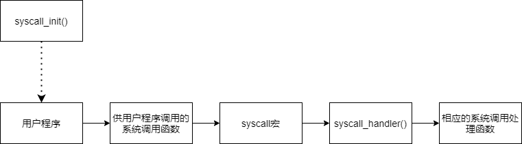

# Pintos-Project2-分析文档

## 1. 小组相关

|  姓名  |   学号   | 贡献百分比 |
| :----: | :------: | :--------: |
| 张涵珂 | 18373734 |    25%     |
|  杨壮  | 17376193 |    25%     |
|  裴昱  | 17375244 |    25%     |
| 杨瑞羿 | 17241055 |    25%     |

## 2. 所分析代码通过测试用例情况


## 3. 相关函数调用关系图以及功能说明

### 3.1 Process Termination Messages

#### 3.1.1 相关函数调用关系图

> 由于本题目仅对`void process_exit(void)`函数进行改动，整体过程可以参考3.2.1的相关函数调用关系图。

#### 3.1.2 功能说明

`void process_exit (void);`

> 用于释放本进程的资源，并且在此打印本题目中所要求的退出信息，详细说明如下所示。

```c
/* 释放当前进程的资源. */
void
process_exit (void)
{
  struct thread *cur = thread_current ();
  uint32_t *pd;

  /* 打印题目所要求的退出信息 */
  printf ("%s: exit(%d)\n",cur->name, cur->st_exit);
    
  /* Destroy the current process's page directory and switch back
     to the kernel-only page directory. */
  pd = cur->pagedir;
  if (pd != NULL)
  {
    /* Correct ordering here is crucial.  We must set
        cur->pagedir to NULL before switching page directories,
        so that a timer interrupt can't switch back to the
        process page directory.  We must activate the base page
        directory before destroying the process's page
        directory, or our active page directory will be one
        that's been freed (and cleared). */
    cur->pagedir = NULL;
    pagedir_activate (NULL);
    pagedir_destroy (pd);
  }
}
```

### 3.2 Argument Passing

#### 3.2.1 相关函数调用关系图


#### 3.2.2 功能说明

`tid_t process_execute (const char *file_name);`

> 用于从`file_name`创建一个用于运行用户程序的新线程。返回值是新进程的TID，当线程不能被创建的时候，返回值是`TID_ERROR`。具体内容如下：

```c
/* Starts a new thread running a user program loaded from
   FILENAME.  The new thread may be scheduled (and may even exit)
   before process_execute() returns.  Returns the new process's
   thread id, or TID_ERROR if the thread cannot be created. */
tid_t
process_execute (const char *file_name)
{
  tid_t tid;
  /* 对file_name做两个拷贝，否则caller和load()之间会有竞争。 */
  char *fn_copy = malloc(strlen(file_name)+1);
  char *fn_copy2 = malloc(strlen(file_name)+1);
  strlcpy (fn_copy, file_name, strlen(file_name)+1);
  strlcpy (fn_copy2, file_name, strlen(file_name)+1);


  /* 创建一个用于执行可执行文件的新进程。 */
  char * save_ptr;//用于存储strtok_r的字符串的数组指针
  fn_copy2 = strtok_r (fn_copy2, " ", &save_ptr);
  tid = thread_create (fn_copy2, PRI_DEFAULT, start_process, fn_copy);//创建线程
  free (fn_copy2);//fn_copy2已经完成了使命，将其释放掉

  if (tid == TID_ERROR){//若创建线程失败，则报错
    free (fn_copy);//释放掉fn_copy2
    return tid;
  }

  /* 获取信号量，等待子进程结束执行 */
  sema_down(&thread_current()->sema);
  if (!thread_current()->success) return TID_ERROR;

  return tid;
}
```


`void push_argument (void **esp, int argc, int argv[]);`

> 根据栈顶指针`esp`和参数数量`argc`两个参数将`argv[]`中的参数压入栈中，具体说明请参考以下注释：

```c
void
push_argument (void **esp, int argc, int argv[]){
  *esp = (int)*esp & 0xfffffffc;//栈对齐
  *esp -= 4;
  *(int *) *esp = 0;//首先放入一个0，防止没有参数的情况出现
  for (int i = argc - 1; i >= 0; i--)//将参数逆序压入栈中
  {
    *esp -= 4;
    *(int *) *esp = argv[i];
  }
  *esp -= 4;
  *(int *) *esp = (int) *esp + 4;//让esp指针指向新的栈顶
  *esp -= 4;
  *(int *) *esp = argc;//将argc压入栈中
  *esp -= 4;
  *(int *) *esp = 0;//将返回地址压入栈中
}
```


`static void start_process (void *file_name_);`

> 在本函数中，interrupt frame将会完成初始化，若初始化成功，则加载可执行文件，分离参数并且传递运行，若初始化失败，则直接退出线程。我们在这个函数中结合`push_argument()`实现了参数分割的任务，具体功能如下所示：

```c
static void
start_process (void *file_name_)
{
  char *file_name = file_name_;
  struct intr_frame if_;
  bool success;

  char *fn_copy=malloc(strlen(file_name)+1);
  strlcpy(fn_copy,file_name,strlen(file_name)+1);

  /* 初始化intr_frame并加载可执行文件. */
  memset (&if_, 0, sizeof if_);
  if_.gs = if_.fs = if_.es = if_.ds = if_.ss = SEL_UDSEG;
  if_.cs = SEL_UCSEG;
  if_.eflags = FLAG_IF | FLAG_MBS;

  char *token, *save_ptr;
  file_name = strtok_r (file_name, " ", &save_ptr);
  success = load (file_name, &if_.eip, &if_.esp);

  if (success){//若初始化成功，则计算参数总数和参数的规格
    int argc = 0;
    int argv[50];//由题目可知，参数的数量不会多于50个
    for (token = strtok_r (fn_copy, " ", &save_ptr); token != NULL; token = strtok_r (NULL, " ", &save_ptr)){
      if_.esp -= (strlen(token)+1);//用户栈向低地址增长，所以是减
      memcpy (if_.esp, token, strlen(token)+1);
      argv[argc++] = (int) if_.esp;//提取参数
    }
    push_argument (&if_.esp, argc, argv);//将参数压入用户栈中
    /* 将exec_status记录到父进程的success中，并且释放信号量。 */
    thread_current ()->parent->success = true;
    sema_up (&thread_current ()->parent->sema);
  }
    
  else{//若初始化失败，则退出线程
    thread_current ()->parent->success = false;
    sema_up (&thread_current ()->parent->sema);
    thread_exit ();
  }

  /* Start the user process by simulating a return from an
     interrupt, implemented by intr_exit (in
     threads/intr-stubs.S).  Because intr_exit takes all of its
     arguments on the stack in the form of a `struct intr_frame',
     we just point the stack pointer (%esp) to our stack frame
     and jump to it. */
  asm volatile ("movl %0, %%esp; jmp intr_exit" : : "g" (&if_) : "memory");
  NOT_REACHED ();
}
```

### 3.3 System Calls

#### 3.3.1 相关函数调用关系图

本部分中的函数实现了不同的系统调用，仅展示共通的调用流程，详细说明见下节；



#### 3.3.2 功能说明

##### 3.3.2.1 初始化

在系统初始化过程中，`init.c` 中的 `main()` 函数调用了 `syscall_init()` 函数，对系统调用功能进行了初始化，其中进行的工作如下：

``` c
void
syscall_init (void) 
{
  intr_register_int (0x30, 3, INTR_ON, syscall_handler, "syscall");
  /* Our implementation for Task2: initialize halt,exit,exec */
  syscalls[SYS_HALT] = &sys_halt;
  syscalls[SYS_EXIT] = &sys_exit;
  syscalls[SYS_EXEC] = &sys_exec;
  /* Our implementation for Task3: initialize create, remove, open, filesize, read, write, seek, tell, and close */
  syscalls[SYS_WAIT] = &sys_wait;
  syscalls[SYS_CREATE] = &sys_create;
  syscalls[SYS_REMOVE] = &sys_remove;
  syscalls[SYS_OPEN] = &sys_open;
  syscalls[SYS_WRITE] = &sys_write;
  syscalls[SYS_SEEK] = &sys_seek;
  syscalls[SYS_TELL] = &sys_tell;
  syscalls[SYS_CLOSE] =&sys_close;
  syscalls[SYS_READ] = &sys_read;
  syscalls[SYS_FILESIZE] = &sys_filesize;
}
```

函数中调用了 `intr_register_int()` 函数，将 0x30 中断处理程序设置为了 `syscall_handler()` 函数，命名为 `syscall`，调用时中断状态为 `INTR_ON`。

此外，为了在 `syscall_handler()` 函数被调用时，能够正确调用需要的系统调用处理函数，还维护了一个函数指针数组 `syscalls[]`，根据相应的系统调用的编号即可获取到对应的处理函数，数组在此处进行了初始化。

##### 3.3.2.2 系统调用的触发过程

系统调用主要由用户程序发起。在 `/lib/user/syscall.c` 中给出了供用户程序调用的系统调用函数，如 `halt()`，`exit()` 等，其中主要的工作为使用相应的参数调用 `syscall0` 或 `syscall1` 或 `syscall2` 或 `syscall3` 宏函数，其区别为接受的参数的数量，实际功能基本相同，在此部分分析中用 `syscall宏` 代指上述四个宏函数。以 `syscall0` 为例，其完成的工作为：

``` c
/* Invokes syscall NUMBER, passing no arguments, and returns the
   return value as an `int'. */
#define syscall0(NUMBER)                                        \
        ({                                                      \
          int retval;                                           \
          asm volatile                                          \
            ("pushl %[number]; int $0x30; addl $4, %%esp"       \
               : "=a" (retval)                                  \
               : [number] "i" (NUMBER)                          \
               : "memory");                                     \
          retval;                                               \
        })
```

其中的核心功能由内联汇编完成：

``` x86asm
pushl $number;       # 将参数入栈
int $0x30;           # 根据中断向量表 0x30 项，修改 CS 和 IP，跳转到中断处理程序入口
addl $4, %%esp;
```

其主要功能为触发 0x30 中断，在这里，number 标识了用户程序调用了哪一个系统调用。参见上文系统调用的初始化，在 `syscall_init()` 中，0x30 中断处理程序被设置为了 `syscall_handler()` 函数，其完成的工作如下：

``` c
static void
syscall_handler (struct intr_frame *f UNUSED)
{
  /* For Task2 practice, just add 1 to its first argument, and print its result */
  int * p = f->esp;       // 取出栈顶指针
  check_ptr2 (p + 1);     // 检查引用是否合法
  int type = * (int *)f->esp;     // 栈顶保存的是系统调用的编号
  if(type <= 0 || type >= max_syscall){
    exit_special ();
  }
  syscalls[type](f);
}
```

函数从栈中取出在 `syscall宏` 保存的 `number`，并根据其值调用相应的系统调用处理函数，各处理函数的功能如下节。

##### 3.3.2.2 系统调用中各处理函数的功能说明

`sys_halt`

> 根据题目描述，函数通过调用定义在 `devices/shutdown.h` 中的 `shutdown_power_off()` 函数，终止 Pintos 的运行。函数的实现较为简单，直接调用提供的函数即可：

``` c
/* Do sytem halt */
void 
sys_halt (struct intr_frame* f)
{
  shutdown_power_off();     // 直接调用已有函数
}
```


`sys_exit`

> 终止当前用户程序的执行。程序执行时栈的情况和详细的流程如下：

``` c
//                    +----------------+
//                    |     status     |
// stack pointer -->  | return address |
//                    +----------------+
//
/* Do sytem exit */
void 
sys_exit (struct intr_frame* f)
{
  uint32_t *user_ptr = f->esp;    // 取出栈顶指针
  check_ptr2 (user_ptr + 1);      // 检查合法性
  *user_ptr++;      // 指针指向退出码
  /* record the exit status of the process */
  thread_current()->st_exit = *user_ptr;  // 保存退出码
  thread_exit ();     // 线程退出
}
```


`sys_exec`

> 执行可执行文件，并返回新线程的 pid。程序执行时栈的情况和详细的流程如下：

``` c
//                    +----------------+
//                    |      file      |
// stack pointer -->  | return address |
//                    +----------------+
//
/* Do sytem exec */
void 
sys_exec (struct intr_frame* f)
{
  uint32_t *user_ptr = f->esp;    // 取出栈顶指针
  check_ptr2 (user_ptr + 1);      // 检查合法性
  check_ptr2 (*(user_ptr + 1));
  *user_ptr++;    // 指针指向待执行的文件
  f->eax = process_execute((char*)* user_ptr);    // 执行程序，利用 eax 寄存器返回 pid
}
```


`sys_wait`

> 等待指定线程退出，并返回其退出的状态码。程序执行时栈的情况和详细的流程如下：

``` c
//                    +----------------+
//                    |      pid       |
// stack pointer -->  | return address |
//                    +----------------+
//
/* Do sytem wait */
void 
sys_wait (struct intr_frame* f)
{
  uint32_t *user_ptr = f->esp;    // 取出栈顶指针
  check_ptr2 (user_ptr + 1);      // 检查合法性
  *user_ptr++;    // 指针指向 pid
  f->eax = process_wait(*user_ptr);     // 调用功能函数
}
```


`sys_create`

> 根据传入的参数，创建新的文件，并返回结果。程序执行时栈的情况和详细的流程如下：

``` c
//                    +----------------+
//                    |  initial_size  |
//                    |      file      |
// stack pointer -->  | return address |
//                    +----------------+
//
/* Do sytem create, we need to acquire lock for file operation in the following methods when do file operation */
void 
sys_create(struct intr_frame* f)
{
  uint32_t *user_ptr = f->esp;      // 取出栈顶指针
  check_ptr2 (user_ptr + 5);        // 检查合法性
  check_ptr2 (*(user_ptr + 4));
  *user_ptr++;      // 指针指向文件名
  acquire_lock_f ();
  f->eax = filesys_create ((const char *)*user_ptr, *(user_ptr+1));   // 调用功能函数并在 eax 中返回结果
  release_lock_f ();
}
```

`sys_remove`

>  获取用户栈指针，在判断调用是否合法后取出文件名，然后获取锁，并通过调用filesys_remove函数进行删除，获得返回值返回给用户，并释放锁，详细功能如下：

```c
/* Do system remove, by calling the method filesys_remove */
void 
sys_remove(struct intr_frame* f)
{
  uint32_t *user_ptr = f->esp;
  check_ptr2 (user_ptr + 1);
  check_ptr2 (*(user_ptr + 1));
  *user_ptr++;
  acquire_lock_f ();
  f->eax = filesys_remove ((const char *)*user_ptr);
  release_lock_f ();
}
}
```

`sys_open`

>  获取用户栈指针，在判断调用是否合法后取出文件名，然后获取锁，并通过调用filesys_opened函数进行尝试打开文件，如果成功获得文件描述符fd，否则则为空，然后释放锁，对之前文件打开结果进行判断，如果打开成功，则将其加入到当前进程锁打开的文件中，然后将文件描述符作为返回值返回给用户，如果打开失败则返回-1，详细功能如下：

```c
/* Do system open, open file by the function filesys_open */
void 
sys_open (struct intr_frame* f)
{
  uint32_t *user_ptr = f->esp;
  check_ptr2 (user_ptr + 1);
  check_ptr2 (*(user_ptr + 1));
  *user_ptr++;
  acquire_lock_f ();
  struct file * file_opened = filesys_open((const char *)*user_ptr);
  release_lock_f ();
  struct thread * t = thread_current();
  if (file_opened)
  {
    struct thread_file *thread_file_temp = malloc(sizeof(struct thread_file));
    thread_file_temp->fd = t->file_fd++;
    thread_file_temp->file = file_opened;
    list_push_back (&t->files, &thread_file_temp->file_elem);
    f->eax = thread_file_temp->fd;
  } 
  else
  {
    f->eax = -1;
  }
}
```

`sys_filesize`

>  获取用户栈指针，在判断调用是否合法后取出文件描述符，在文件列表中查找文件位置，并用thread_file_temp变量进行暂时保存，然后如果找到了该文件，则获取锁，并通过file_length函数获取该文件大小，并作为返回值返回给用户然后释放锁，如果在文件列表中未找到，则返回-1，详细功能如下：

```c
/* Do system filesize, by calling the function file_length() in filesystem */
void 
sys_filesize (struct intr_frame* f){
  uint32_t *user_ptr = f->esp;
  check_ptr2 (user_ptr + 1);
  *user_ptr++;
  struct thread_file * thread_file_temp = find_file_id (*user_ptr);
  if (thread_file_temp)
  {
    acquire_lock_f ();
    f->eax = file_length (thread_file_temp->file);
    release_lock_f ();
  } 
  else
  {
    f->eax = -1;
  }
}
```

`sys_read`

>  获取用户栈指针，在判断调用是否合法后，取出文件描述符、缓冲区、读的size三个参数，然后对这三个参数验证合法性，然后判断该fd是否为0，即判断是否从标准输入中读入，如果为0，则调用input_getc在标准输入中读入信息，并用buffer存储，并将读取的size作为返回值返回给用户，如果fd不为0，则根据fd从文件列表中找到对应文件，并返回对应文件结构体，然后如果找到了该文件描述符对应的文件，则获取锁，并调用file_read函数从文件中读取size大小的信息，并将其作为返回值返回，然后释放锁；如果没有找到该文件，则返回-1，详细功能如下：

```c
/* Do system read, by calling the function file_tell() in filesystem */
void 
sys_read (struct intr_frame* f)
{
  uint32_t *user_ptr = f->esp;
  /* PASS the test bad read */
  *user_ptr++;
  /* We don't konw how to fix the bug, just check the pointer */
  int fd = *user_ptr;
  int i;
  uint8_t * buffer = (uint8_t*)*(user_ptr+1);
  off_t size = *(user_ptr+2);
  if (!is_valid_pointer (buffer, 1) || !is_valid_pointer (buffer + size,1)){
    exit_special ();
  }
  /* get the files buffer */
  if (fd == 0) 
  {
    for (i = 0; i < size; i++)
      buffer[i] = input_getc();
    f->eax = size;
  }
  else
  {
    struct thread_file * thread_file_temp = find_file_id (*user_ptr);
    if (thread_file_temp)
    {
      acquire_lock_f ();
      f->eax = file_read (thread_file_temp->file, buffer, size);
      release_lock_f ();
    } 
    else
    {
      f->eax = -1;
    }
  }
}
```

`sys_write`

>  获取用户栈指针，在判断调用是否合法后，取出文件描述符、缓冲区、读的size三个参数，然后对这三个参数验证合法性，然后判断该fd是否为1，即判断是否将buffer中内容输出到标准输出中，如果为1，则调用putbuf将buffer中size大小的数据输出到标准输出，并将写出的size作为返回值返回给用户，如果fd不为1，则根据fd从文件列表中找到对应文件，并返回对应文件结构体，然后如果找到了该文件描述符对应的文件，则获取锁，并调用file_write函数将buffer中size大小的信息写入到文件，并将size作为返回值返回，然后释放锁；如果没有找到该文件，则返回-1，详细功能如下：

```c
/* Do system write, Do writing in stdout and write in files */
void 
sys_write (struct intr_frame* f)
{
  uint32_t *user_ptr = f->esp;
  check_ptr2 (user_ptr + 7);
  check_ptr2 (*(user_ptr + 6));
  *user_ptr++;
  int temp2 = *user_ptr;
  const char * buffer = (const char *)*(user_ptr+1);
  off_t size = *(user_ptr+2);
  if (temp2 == 1) {
    /* Use putbuf to do testing */
    putbuf(buffer,size);
    f->eax = size;
  }
  else
  {
    /* Write to Files */
    struct thread_file * thread_file_temp = find_file_id (*user_ptr);
    if (thread_file_temp)
    {
      acquire_lock_f ();
      f->eax = file_write (thread_file_temp->file, buffer, size);
      release_lock_f ();
    } 
    else
    {
      f->eax = -1;
    }
  }
}
```

`sys_seek`

>  获取用户栈指针，在判断调用是否合法后取出文件描述符，在文件列表中查找文件位置，并用file_seek函数保存文件位置，详细功能如下：

```c
/* Do system seek, by calling the function file_seek() in filesystem */
void 
sys_seek(struct intr_frame* f)
{
  uint32_t *user_ptr = f->esp; //获取用户栈指针
  check_ptr2 (user_ptr + 5); //调用check_ptr2()函数判断当前调用是否合法
  *user_ptr++; //通过用户栈指针从用户栈中取出要查找的文件的文件描述符fd
  struct thread_file *file_temp = find_file_id (*user_ptr); //调用file_find_id函数传入此fd作为参数返回查询结果
  if (file_temp) //找到且返回了该文件（即该文件对应的结构体）
  {
    acquire_lock_f (); //获取锁
    file_seek (file_temp->file, *(user_ptr+1)); //调用file_seek()函数获取文件指针并保存文件位置
    release_lock_f (); //释放锁
  }
}
```

`sys_tell`

> 获取用户栈指针，在判断调用是否合法后取出文件描述符，在文件列表中查找文件位置，如果找到，将结果返回到eax，未找到则将eax置为-1，详细功能如下：

```c
/* Do system tell, by calling the function file_tell() in filesystem */
void 
sys_tell (struct intr_frame* f)
{
  uint32_t *user_ptr = f->esp; //获取用户栈指针
  check_ptr2 (user_ptr + 1); //调用check_ptr2()函数判断当前调用是否合法
  *user_ptr++; //通过用户栈指针从用户栈中取出要查找的文件的文件描述符fd
  struct thread_file *thread_file_temp = find_file_id (*user_ptr); //调用file_find_id函数传入此fd作为参数返回查询结果
  if (thread_file_temp) //找到了文件
  {
    acquire_lock_f (); //获取锁
    f->eax = file_tell (thread_file_temp->file); //调用file_tell()函数返回文件位置并返回结果到eax中
    release_lock_f (); //释放锁
  }else{
    f->eax = -1; //没找到，将返回值eax置为-1后返回-
  }
}
```

`sys_close`

> 获取用户栈指针，在判断调用是否合法后取出文件描述符，在文件列表中查找文件位置，如果找到，说明文件打开，用file_close函数关闭文件，并将文件从线程列表中移除，详细功能如下

```c
/* Do system close, by calling the function file_close() in filesystem */
void 
sys_close (struct intr_frame* f)
{
  uint32_t *user_ptr = f->esp; //获取用户栈指针
  check_ptr2 (user_ptr + 1); //调用check_ptr2()函数判断当前调用是否合法
  *user_ptr++; //通过用户栈指针从用户栈中取出要查找的文件的文件描述符fd
  struct thread_file * opened_file = find_file_id (*user_ptr);//调用file_find_id函数传入此fd作为参数返回查询结果
  if (opened_file)//找到了该文件
  {
    acquire_lock_f ();//获取锁
    file_close (opened_file->file); //调用file_close()函数关闭文件
    release_lock_f (); //释放锁
    /* Remove the opened file from the list */
    list_remove (&opened_file->file_elem);//将该文件从线程列表中移除
    /* Free opened files */
    free (opened_file);//释放该文件
  }
}
```


### 3.4 Denying Writes to Executables

#### 3.4.1 相关函数调用关系图


#### 3.4.2 功能说明
<file.c>

`file_deny_write`

> 通过改变file中deny_write的bool值为true使其在打开后不可写
>
> 同时还将inode中deny_write_node的值加1，以便后续allow_write判断
>
> file_allow_write:通过改变file中deny_write的bool值为false使文件在关闭后恢复可写
>
> 同时还将inode中deny_write_node的值减1

```c
/* Prevents write operations on FILE's underlying inode
   until file_allow_write() is called or FILE is closed. */
void
file_deny_write (struct file *file) 
{
  ASSERT (file != NULL); /*judge whether file is null*/
  if (!file->deny_write)  /*judge the value of deny_write, which belongs to file*/
    {
      file->deny_write = true;  /*ensure that deny_write is true*/
      inode_deny_write (file->inode);
      /*call function inode_deny_write to add deny_write_node with 1*/
    }
}

/* Re-enables write operations on FILE's underlying inode.
   (Writes might still be denied by some other file that has the
   same inode open.) */
void
file_allow_write (struct file *file) 
{
  ASSERT (file != NULL);/*judge whether file is null*/
  if (file->deny_write)  /*judge the value of deny_write, which belongs to file*/
    {
      file->deny_write = false; /*ensure that deny_write is false*/
      inode_allow_write (file->inode);
      /*call function inode_deny_write to substract deny_write_node by 1*/
    }
}
```

<inode.c>

`inode_deny_write`

> 将deny_write_cnt+1,同时保证deny_write_cnt<=open_cnt，保证逻辑关系为：在打开文件后禁止写入

`inode_allow_write`

> 将deny_write_cnt-1,同时保证deny_write_cnt > 0，而且deny_write_cnt<=open_cnt，保证逻辑关系为：在关上文件后恢复可写入，而且原来文件状态是打开且禁止写入的

```c
/* Disables writes to INODE.
   May be called at most once per inode opener. */
void
inode_deny_write (struct inode *inode) 
{
  inode->deny_write_cnt++; /*add deny_write_cnt with 1*/
  ASSERT (inode->deny_write_cnt <= inode->open_cnt);
}

/* Re-enables writes to INODE.
   Must be called once by each inode opener who has called
   inode_deny_write() on the inode, before closing the inode. */
void
inode_allow_write (struct inode *inode) 
{
  ASSERT (inode->deny_write_cnt > 0); /*ensure deny_write_cnt is positive*/
  ASSERT (inode->deny_write_cnt <= inode->open_cnt); 
    /*ensure the value above is smaller than number of openers*/
  inode->deny_write_cnt--; /*substract deny_write_cnt with 1*/
}
```


## 4. 相关数据结构分析说明

### 4.1 Process Termination Messages

> 我们在`threads/thread.c`的`struct thread`结构中增加了`int st_exit`参数，用于保存进程退出时的状态。

### 4.2 Argument Passing

> 在本任务中，我们没有增加新的数据结构。

### 4.3 System Calls

```c
struct thread_file
{
    int fd;
    struct file* file;
    struct list_elem file_elem;
};
struct thread
{
    /* Owned by thread.c. */
    tid_t tid;                          /* Thread identifier. */
    enum thread_status status;          /* Thread state. */
    char name[16];                      /* Name (for debugging purposes). */
    uint8_t *stack;                     /* Saved stack pointer. */
    int priority;                       /* Priority. */
    struct list_elem allelem;           /* List element for all threads list. */

    /* Shared between thread.c and synch.c. */
    struct list_elem elem;              /* List element. */

#ifdef USERPROG
    /* Owned by userprog/process.c. */
    uint32_t *pagedir;                  /* Page directory. */
#endif

    /* Owned by thread.c. */
    unsigned magic;  
    /* 添加的 */
    struct list childs;                 /* The list of childs */
    struct child * thread_child;        /* Store the child of this thread */
    int st_exit;                        /* Exit status */
    struct semaphore sema;              /* Control the child process's logic, finish parent waiting for child */
    bool success;                       /* Judge whehter the child's thread execute successfully */
    struct thread* parent;              /* Parent thread of the thread */
    
    /* Structure for Task3 */
    struct list files;                  /* List of opened files */
    int file_fd;                        /* File's descriptor */
    struct file * file_owned;           /* The file opened */

};
struct child
{
    tid_t tid;                           /* tid of the thread */
    bool isrun;                          /* whether the child's thread is run successfully */
    struct list_elem child_elem;         /* list of children */
    struct semaphore sema;               /* semaphore to control waiting */
    int store_exit;                      /* the exit status of child thread */
};
```

> 在本task中，我们在实验原有代码的基础上增加了以上所示的数据结构，然后对每个数据结构进行一些分析。

> 首先是对于**thread_file**结构体，其主要功能是用于表示每个进程所打开的文件；其中**fd**成员是文件描述符，也就是每个文件所唯一对应的一个int值，可以唯一描述一个文件；然后**file**成员则是使用了**filesys.h**中所定义的file结构体，其中包含**inode**等信息，具体这里不再赘述，也是用于描述一个文件所必须的信息；然后**file_elem**成员则是为了让该结构体能够正常放入**List**所增加的成员，实际并无太大意义，可以通过**thread**中的**files**成员来遍历某进程所打开的所有文件
>
> 总的来说就是方便在系统调用中和文件相关的操作能够更加方便且创建该结构体也是必要的。

```c
struct thread_file
{
    int fd;
    struct file* file;
    struct list_elem file_elem;
};
```

> 然后是在thread函数体中所添加的一些成员，如下所示；
>
> 首先对于childs，是一个列表，存放该进程的所有子进程，其中child结构体也会在之后说到，用于描述进程的子进程，childs则是存放进程子进程的列表；然后thread_child和parent则是用于存放该进程的当前直接子进程和父进程，在程序执行时也是不断变化的；然后是st_exit成员，该成员是描述进程的返回状态的，在task1中已经介绍的比较详细，即存放进程的退出状态；然后对于sema成员，其类型是信号量，主要功能则是控制子进程的逻辑，在父进程等待子进程中用于进程之间通信；然后是一个布尔变量success，用于描述子进程是否成功返回；然后是上文提到过的files，存放该文件所打开的所有文件的列表，并且在通过fd找对应文件时也会频繁用到，file_fd则描述某个文件的文件描述符，用于存放某一时刻该进程所对应文件的文件描述符；最后则是file_owned，描述其某时刻所拥有的文件。

```c
struct list childs;                 /* The list of childs */
struct child * thread_child;        /* Store the child of this thread */
int st_exit;                        /* Exit status */
struct semaphore sema;              /* Control the child process's logic, finish parent waiting for child */
bool success;                       /* Judge whehter the child's thread execute successfully */
struct thread* parent;              /* Parent thread of the thread */

struct list files;                  /* List of opened files */
int file_fd;                        /* File's descriptor */
struct file * file_owned;           /* The file opened */
```

>最后则是用于描述子进程的结构体child，如下所示：
>
>对于第一个成员tid，则是该子进程的tid，与进程唯一对应；然后是isrun布尔变量，描述该子进程是否成功执行；然后child_elem成员则是让该结构体能够被放入List列表中，即thread结构体中从childs结构体，方便遍历等操作，然后是信号量sema用于控制waiting以及唤醒，最后则是store_exit，和thread结构体内的成员一样，用于描述该进程的返回状态。

```c
struct child
{
    tid_t tid;                           /* tid of the thread */
    bool isrun;                          /* whether the child's thread is run successfully */
    struct list_elem child_elem;         /* list of children */
    struct semaphore sema;               /* semaphore to control waiting */
    int store_exit;                      /* the exit status of child thread */
};
```

### 4.4 Denying Writes to Executables

file.c

```c
/* An open file. */
struct file 
  {
    struct inode *inode;        /* File's inode. */
    off_t pos;                  /* Current position. */
    bool deny_write;            /* Has file_deny_write() been called? */
  };
```

对于结构体file而言，其数据结构中包含一个inode以及负责存贮其目前位置的off_t值 pos，另外，其bool值deny_write用来表述一个文件是否被调用类file_deny_write()函数（即出于可执行不可写阶段）

对于inode结构体的详述如下：


inode.c

```c
/* In-memory inode. */
struct inode 
  {
    struct list_elem elem;              /* Element in inode list. */
    block_sector_t sector;              /* Sector number of disk location. */
    int open_cnt;                       /* Number of openers. */
    bool removed;                       /* True if deleted, false otherwise. */
    int deny_write_cnt;                 /* 0: writes ok, >0: deny writes. */
    struct inode_disk data;             /* Inode content. */
  };

```

inode结构体中，与file_deny_write() 和 file_allow_write()有关联的项主要为int类数据open_cnt 和deny_write_cnt，其中前者用来表述文件打开的次数，用于和后者比较：只有在deny_write_cnt > 0同时deny_write_cnt <= open_cnt时，才能恢复可写状态。后者则在file_deny_write() 和 file_allow_write()中被用于+1或-1以表述文件此时的状态


## 5. 相关函数流程图分析说明

### 5.1 Process Termination Messages

`void process_exit (void);`


### 5.2 Argument Passing

`tid_t process_execute (const char *file_name);`


`void push_argument (void **esp, int argc, int argv[]);`


`static void start_process (void *file_name_);`


### 5.3 System Calls

`sys_halt()`

> 函数的功能比较简单，直接调用了系统提供的函数。


`sys_exit()`


`sys_exec()`


`sys_wait()`


`sys_create()`


`sys_remove()`


`sys_open()`


`sys_filesize()`


`sys_read()`


`sys_write()`


`sys_seek()`


`sys_tell()`


`sys_close()`


### 5.4 Denying Writes to Executables
`file_deny_write()`


`file_allow_write()`


## 6. 设计文档问题解答

### 6.1 Argument Passing

#### 6.1.1 Data Structures

A1: Copy here the declaration of each new or changed `struct' or
`struct' member, global or static variable, `typedef', or enumeration.  Identify the purpose of each in 25 words or less.

> 在进程终止消息任务的设计中，我们向`threads/thread.c`的`struct thread`中添加一个`int st_exit`，用于存储进程退出时的状态。
>
> 在参数传递的设计中，我们没有增加新的数据结构。

#### 6.1.2 Algorithms

A2: Briefly describe how you implemented argument parsing.  How do you arrange for the elements of argv[] to be in the right order? How do you avoid overflowing the stack page?

> 经过对代码内容的阅读可知，`process_execute`提供了`file_name`这一参数，在该参数中包含了文件名和参数，要传递参数，则首先要对其进行参数分离，所以我们引入了`strtok_r()`这个线程安全的字符串分割函数对其进行分割。为保证合适的分割时机，我们继续观察了pintos的用户进程执行逻辑：在`process_execute`创建进程之后，pintos并不会直接运行可执行文件，而是进入了`start_process()`对interrupt frame完成初始化，并运行了用于分配内存的`load()`函数，在`load()`函数之后才会对栈进行初始化`setup_stack()`。所以，我们在`load()`函数执行之后再进行字符串分割和压栈的操作。为达成传递参数的目的，我们额外创建了`push_argument()`函数，用于处理字符串并将其压入栈中，具体的逻辑可以参考对`push_argument()`函数的功能说明。
>
> 为保证对于参数的正确解析，我们先使用`strtok_r()`对输入值进行分割，得到`argc`的值然后把参数存储到`argv[]`数组中，然后将`argc`和`argv[]`作为参数传递给`push_argument()`，将其逆序压入栈中，这样就可以保证参数的顺序是正确的。

#### 6.1.3 Rationale

A3: Why does Pintos implement strtok_r() but not strtok()?

> 因为当在多线程调用`strtok()`的情况下，`strtok()`随时都可以被中断，它所使用的全局变量导致了最终输出的结果是不确定的。而`strtok_r()`所使用的`save_ptr()`指针则可以保证在多线程调用的情况下的线程安全性。

A4: In Pintos, the kernel separates commands into a executable name and arguments.  In Unix-like systems, the shell does this separation.  Identify at least two advantages of the Unix approach.

> 1. Unix方式比较可靠，即使shell崩溃了也不会对内核乃至整个系统的运行造成巨大影响。
> 2. Unix方式减少了内核的不必要的功能，使得维护起来更加方便更加模块化。
> 3. shell所具有的权限较小，即使遭受恶意攻击也不会过度影响到系统安全，具有很高的安全性。

### 6.2 System Calls

#### 6.2.1 Data Structures

B1: Copy here the declaration of each new or changed `struct' or
`struct' member, global or static variable, `typedef', or enumeration.  Identify the purpose of each in 25 words or less.

> 创建了一个child的struct，用于描述子进程。
> 
> ```c
> struct child
> {
>     tid_t tid;                           /* tid of the thread */
>     bool isrun;                          /* whether the child's thread is run successfully */
>     struct list_elem child_elem;         /* list of children */
>     struct semaphore sema;               /* semaphore to control waiting */
>     int store_exit;                      /* the exit status of child thread */
> };
> ```
> 
> 在thread结构体中新加入了一些成员，用于更好的在系统调用中使用thread
> 
> ```c
> struct list childs;                 /* The list of childs */
> struct child * thread_child;        /* Store the child of this thread */
> int st_exit;                        /* Exit status */
> struct semaphore sema;              /* Control the child process's logic, finish parent waiting for child */
> bool success;                       /* Judge whehter the child's thread execute successfully */
> struct thread* parent;              /* Parent thread of the thread */
> ```
> 
> 我们还创建一个结构体thread_file用于描述进程打开的文件
> 
> ```c
> struct thread_file{
>     int fd;
>     struct file* file;
>     struct list_elem file_elem;
> };
> ```

B2: Describe how file descriptors are associated with open files. Are file descriptors unique within the entire OS or just within a single process?

> 与文件相关的几个数据结构如下：
>
> ``` c
> struct file 
>  {
>    struct inode *inode;        /* File's inode. */
>    off_t pos;                  /* Current position. */
>    bool deny_write;            /* Has file_deny_write() been called? */
>  };
> ```
>
> ``` c
> struct inode 
>   {
>     struct list_elem elem;              /* Element in inode list. */
>     block_sector_t sector;              /* Sector number of disk location. */
>     int open_cnt;                       /* Number of openers. */
>     bool removed;                       /* True if deleted, false otherwise. */
>     int deny_write_cnt;                 /* 0: writes ok, >0: deny writes. */
>     struct inode_disk data;             /* Inode content. */
>   };
> ```
> 
> 其中，struct file 变量是某线程所持有的，仅在线程范围内是独有的；而 struct inode 变量是操作系统维护、与实际的文件一一对应、整个操作系统范围内是不重复的。
> 
> 通过打开文件的调用过程不难看出这一点，整个调用流程大致如下
>
> ```
> 用户程序 ==> open() ==> sys_open() ==> filesys_open() ==> dir_lookup() ==> inode_open() ==> file_open (inode)
> ```
>
> 整个打开文件的核心都围绕着 inode 的操作展开，并且在 `inode_open()` 中对目标文件是否已经被打开过进行了判断，印证了 struct inode 变量在操作系统范围内唯一。而最终取到 inode 后，即可执行 `file_open()`，并无限制，多个线程在流程中取得同一 inode 后，也可以通过相同的方式创建相同的 struct file 变量。

#### 6.2.2 Algorithms

B3: Describe your code for reading and writing user data from the kernel.


B4: Suppose a system call causes a full page (4,096 bytes) of data to be copied from user space into the kernel.  What is the least and the greatest possible number of inspections of the page table (e.g. calls to pagedir_get_page()) that might result?  What about for a system call that only copies 2 bytes of data?  Is there room for improvement in these numbers, and how much?


B5: Briefly describe your implementation of the "wait" system call and how it interacts with process termination.


B6: Any access to user program memory at a user-specified address can fail due to a bad pointer value.  Such accesses must cause the process to be terminated.  System calls are fraught with such accesses, e.g. a "write" system call requires reading the system call number from the user stack, then each of the call's three arguments, then an arbitrary amount of user memory, and any of these can fail at any point.  This poses a design and error-handling problem: how do you best avoid obscuring the primary function of code in a morass of error-handling?  Furthermore, when an error is detected, how do you ensure that all temporarily allocated resources (locks, buffers, etc.) are freed?  In a few paragraphs, describe the strategy or strategies you adopted for managing these issues.  Give an example.


#### 6.2.3 Synchronization

B7: The "exec" system call returns -1 if loading the new executable fails, so it cannot return before the new executable has completed loading.  How does your code ensure this?  How is the load success/failure status passed back to the thread that calls "exec"?


B8: Consider parent process P with child process C.  How do you ensure proper synchronization and avoid race conditions when P calls wait(C) before C exits?  After C exits?  How do you ensure that all resources are freed in each case?  How about when P terminates without waiting, before C exits?  After C exits?  Are there any special cases?


#### 6.2.4 Rationale

B9: Why did you choose to implement access to user memory from the kernel in the way that you did?


B10: What advantages or disadvantages can you see to your design for file descriptors?


B11: The default tid_t to pid_t mapping is the identity mapping. If you changed it, what advantages are there to your approach?
