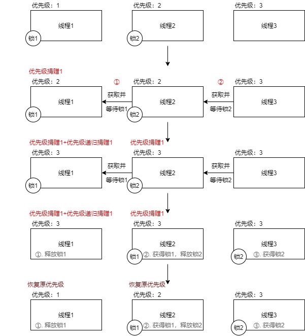

# 小组相关

|  姓名  |   学号   | 贡献百分比 |
| :----: | :------: | :--------: |
| 张涵珂 | 18373734 |    25%     |
|  杨壮  | 17376193 |    25%     |
|  裴昱  | 17375244 |    25%     |
| 杨瑞羿 | 17241055 |    25%     |

#### Github截图


# 通过用例情况


# 需求分析

## ALARM CLOCK

#### 1. 概述

重写 `timer_sleep()` 函数，取代其中的 busy waiting 设计，以提高 CPU 的利用率。

#### 2. 题目分析

虽然提供的代码中已经实现了 `timer_sleep()` 的功能，但是其中使用了 `while` 循环反复检查 ticks，调用 `thread_yield()`，浪费了许多 CPU 时间。

在解决思路上，将利用必要的变量和方法，实现当 `timer_sleep()` 被调用时，线程离开 `ready_list`，不再占用 CPU 时间，直到所设置的睡眠时间已到达，线程重新回到 `ready_list`。

## PRIORITY SCHEDULING

#### 1. 概述

题目要求在 Pintos 中实现优先级调度，并解决优先级捐赠的问题。

#### 2. 题目分析

在本项问题中，我们需要在 Pintos 中实现优先级调度。即，当一个高于当前运行的线程优先级的线程被添加到准备队列中时，当前线程应立即将资源让渡给该线程。

为实现优先级调度，我们需要解决优先级翻转问题，即：假设有 H、M、L 三个线程，他们的优先级依次降低，若 H 需要等待 L 所持有的锁，而 M 在准备队列里时，H 永远不会得到 CPU 资源。为解决此问题，我们要考虑到优先级捐赠的不同情况，比如多层捐赠和嵌套捐赠。根据题目要求可知，我们只需对锁实现优先级捐赠即可。

此外，我们还需要实现 `void thread_set_priority(int new_priority)` 以及 `int thread_get_priority(void)` 两个函数，他们的作用分别是线程修改和检查自己的优先级。

## ADVANCED SCHEDULER

#### 1. 概述

按照要求实现多级反馈调度（Advanced Scheduler or 4.4BSD Schduler），以减少系统平均响应时间

#### 2. 题目分析

##### 2.1 nice 值

和优先级调度器一样，高级调度器根据优先级来选择运行的线程。题中已经给出线程优先级的计算公式（在 2.2 中会详细介绍）。另外，对于每个线程，还有一个整数 nice 值，用于与其他线程进行比较。有关 nice 值的比较方法如下：

1.nice=0，此时不影响线程优先级

2.20≥nice>0，此时线程优先级降低，减少其本应该获取的CPU时间

3.0<nice≤-20，此时线程优先级降低，使得线程能从其他线程处获取CPU时间

题目给出函数及需要实现的功能如下：

1. int thread_get_nice(void)

   返回当前线程的 nice 值

2. void thread_set_nice(int new_nice)

   重置当前线程的 nice 值，并且重新计算线程优先级，如果重置后线程不再有最高的优先级，则让渡给当前优先级最高的线程。

##### 2.2 线程优先级计算

我们需要维持 64 个队列，每个队列有一个优先级，从 0（PRI_MIN）到 63（PRI_MAX），数字越大优先级越高，在线程初始化的时候，或者每过四个 clock tick ，线程优先级就会被重新计算一次，计算方式如下：

 `priority = PRI_MAX - (recent_cpu / 4) - (nice * 2)`

式子中的 recent_cpu 计算方式见 2.3，nice 则是当前线程的 nice 值，计算结果四舍五入，无论如何计算结果必须满足为 0 - 63 的一个整数

##### 2.3 recent_cpu计算方式

由于计算的是每个进程在最近一段时间内获得的CPU时间，而时间越近，CPU的权重应该相对更大（可以理解为前1s或前第2s即使获得的cpu时间相同，前1s的权重占比也应该更高）

rencent_cpu计算公式如下：

 `recent_cpu = (2*load_avg)/(2*load_avg + 1) * recent_cpu + nice`, 

式中load_avg是准备运行的线程数的移动均值，计算方式见2.4

由于nice值的影响，recent_cpu的值可能是负数，不需要将负数值置0

题目给出函数及需要实现的功能如下：

int thread_get_recent_cpu(void)

​    返回当前线程的recent_cpu*100再四舍五入后的值

##### 2.4 load_avg计算方式

load_avg需要返回的是在上一分钟，等待运行的线程数量的平均值

公式如下：

 `load_avg = (59/60)*load_avg + (1/60)*ready_threads`, 

题目给出函数及需要实现的功能如下：

int thread_get_load_avg(void)

​    返回当前线程的load_avg*100再四舍五入后的值

#### 3. 总结——需要实现的功能

按照题目要求，实现2.1—2.4中各项函数的功能，满足算数运算逻辑

考虑到Pintos本身没有浮点数运算的功能，还需实现函数进行实数运算

# 功能设计

## ALARM CLOCK

#### 1. 整体思路

需要修改的 `timer_sleep()` 函数主要的功能为：

* 调用此函数的线程在一段时间内不会再执行
* 经过一段给定的时间后，调用此函数的线程重新开始执行

修改前的 `timer_sleep()` 函数实现这个功能的方法是，在给定的时间经过之前，即使此线程获得了 CPU 时间，实际执行的内容依然在 `timer_sleep()` 函数中，以此实现了线程不继续执行后续指令的效果。缺点显而易见是会浪费一部分的 CPU 时间。

改进的思路需要解决一下问题：

* 如何在线程调用 `timer_sleep()` 函数后，直到给定的时间经过之前，不再占用 CPU 时间
* 如何在经过了给定的时间后，线程能够重新恢复执行

只要解决了这两个问题，新的 `timer_sleep()` 就可以满足需求了。

#### 2. 解决方法

为了解决第一个问题，我们知道 Pintos 维护着 `ready_list`，`就绪`状态的线程，即有机会占用 CPU 的线程，会出现在 `ready_list` 中。为了不让调用 `timer_sleep()` 函数的线程占用 CPU 时间，不让其出现在 `ready_list` 中即可。所以我们在 `timer_sleep()` 函数中调用了 `thread_block()` 函数，使当前线程由`执行`状态变为`阻塞`状态，并重新执行 CPU 调度，选择一个新的就绪态线程执行。

现在，调用 `timer_sleep()` 的函数将不会再占用 CPU 时间，解决了繁忙等待的设计缺陷。接下来需要解决的是，进入了`阻塞`状态的线程如何恢复到`就绪`状态，即需要实现这一功能：

```
经过给定的时间后，阻塞状态的线程恢复为就绪状态。
```

在原先的设计中，`给定时间`由 `timer_sleep()` 函数维护，现在线程进入阻塞状态，不能再使用原先的检查时间经过的方法。为了在线程在阻塞状态时，管理线程的函数依然能获取到`给定时间`等必要信息，来确定是否重新唤醒此线程，需要将`给定时间`作为线程的参数添加到 `struct thread` 中。我们添加了 `waiting_time` 词条来表示`给定时间`。修改后，`struct thread` 的内容如下：

``` c
struct thread
  {
    /* Owned by thread.c. */
    tid_t tid;                          /* Thread identifier. */
    enum thread_status status;          /* Thread state. */
    char name[16];                      /* Name (for debugging purposes). */
    uint8_t *stack;                     /* Saved stack pointer. */
    int priority;                       /* Priority. */
    struct list_elem allelem;           /* List element for all threads list. */

    /* alarm. */
    int waiting_time;                   /* blocked time.(线程阻塞时间) */ 

    /* Shared between thread.c and synch.c. */
    struct list_elem elem;              /* List element. */

#ifdef USERPROG
    /* Owned by userprog/process.c. */
    uint32_t *pagedir;                  /* Page directory. */
#endif

    /* Owned by thread.c. */
    unsigned magic;                     /* Detects stack overflow. */
  };
```

在此更改同时，在线程初始化过程中也添加了对应的初始化，使其初始化为0。

到此，我们已经解决了「给定时间」的问题，管理线程的函数可以获取到因为调用了 `timer_sleep()` 而进入阻塞状态的线程仍需要等待多久的时间。接下来，我们只需要在「给定时间」经过后重新唤醒线程即可。

解决方法是，在每次时钟中断中，使阻塞中的线程的 `waiting_time` 值 `-1`，使其在任何时刻都代表`线程仍需等待的时间`。而当值变为 `0` 时，调用 `thread_unblock()` 使此线程恢复为就绪状态。对应的实现函数为：

``` c
static void 
time_minus (struct thread *thread, void *aux UNUSED)
{
  /*
    判断当前线程是否为阻塞 如果为阻塞状态 则将其阻塞时间-1
    如果阻塞时间已经减为0 则将其唤醒 放入就绪队列中
  */
  if (thread->status!=THREAD_BLOCKED) {
    return;
  }
  else {
    thread->waiting_time--;
    if (!thread->waiting_time) thread_unblock(thread);
  }
}
```

最后，在时钟中断处理函数 `timer_interrupt()` 中添加对上函数的调用即可：

``` c
/* Timer interrupt handler. */
static void
timer_interrupt (struct intr_frame *args UNUSED)
{
  // ...
  ticks++;
  thread_foreach(time_minus, NULL); // 对每一个线程执行time_minus()
  // ...
}
```

至此，对 `timer_sleep()` 的重新实现已经完全完成。

## PRIORITY SCHEDULING

#### 1. 优先级调度的实现

为实现优先级调度，我们将准备队列设计成了一个优先队列，即每创建一个线程或者改变线程的优先级的时候，就将其按优先级大小插入到队列中，这样就可以保证优先级最高的在队列最前端，并将其执行。

#### 2. 优先级调度相关的函数修改

经过对`Pintos`的代码进行分析，我们发现，当调用`thread_yield()`、`thread_unlock()`、`init_thread()`的时候会将线程加入准备队列，因此，修改这几个函数里加入准备队列的函数即可。

通过对测试样例的分析，我们还要修改信号量和条件变量相关的函数，确保`waiters`队列里优先级最高的线程能够最先执行。

#### 3. 优先级捐赠问题的解决方案

对于优先级翻转问题，我们的设计是，若存在如需求分析中的H、M、L三个线程且L持有H所需的锁，就将L线程的优先级提高到与H进程相同的优先级，若有嵌套捐赠，则递归执行。

#### 4. 新增函数实现

题目中要求我们实现的两个函数，内容如下：

`void thread_set_priority(int new_priority)`：

```c
void
thread_set_priority (int new_priority) 
{
  if (thread_mlfqs) return;
  if (list_empty(&thread_current()->lock_list)) {
    thread_current()->priority = new_priority;
    thread_current()->original_pri = thread_current()->priority;
    thread_yield();
  }
  else if (new_priority > thread_current()->priority) {
    thread_current()->priority = new_priority;
    thread_current()->original_pri = new_priority;
    thread_yield();
  } else {
    thread_current()->original_pri = new_priority;
  }
}
```

`int thread_get_priority(void)`：

```c
int
thread_get_priority (void) 
{
  return thread_current ()->priority;
}
```


## ADVANCED SCHEDULER

#### 1.浮点数运算：

| 功能                                           | 计算式                                                       |
| ---------------------------------------------- | ------------------------------------------------------------ |
| Convert `n` to fixed point:                    | `n * f`                                                      |
| Convert `x` to integer (rounding toward zero): | `x / f`                                                      |
| Convert `x` to integer (rounding to nearest):  | `(x + f / 2) / f` if `x >= 0`, `(x - f / 2) / f` if `x <= 0`. |
| Add `x` and `y`:                               | `x + y`                                                      |
| Subtract `y` from `x`:                         | `x - y`                                                      |
| Add `x` and `n`:                               | `x + n * f`                                                  |
| Subtract `n` from `x`:                         | `x - n * f`                                                  |
| Multiply `x` by `y`:                           | `((int64_t) x) * y / f`                                      |
| Multiply `x` by `n`:                           | `x * n`                                                      |
| Divide `x` by `y`:                             | `((int64_t) x) * f / y`                                      |
| Divide `x` by `n`:                             | `x / n`                                                      |

在threads文件夹下fix.c文件中实现代码如下：

```c
fixed_point integer_convert_to_fixedPoint(fixed_point n) {
    return n * f;
}

int fixedPoint_convert_to_integer_roundToZero(fixed_point x) {
    return x / f;
}

int fixedPoint_convert_to_integer_roundToNearest(fixed_point x) {
    return x <= 0 ? (x - f / 2) / f : (x + f / 2) / f;
}

fixed_point add_between_fixedPoints(fixed_point x, fixed_point y) {
    return x + y;
}

/* substract y from x. */
fixed_point substract_between_fixedPoints(fixed_point x, fixed_point y) {
    return x - y;
}

fixed_point add_between_fixedPoints_and_integer(fixed_point x, int n){
    return x + n * f;
}

/* substract n from x. */
fixed_point substractmultiply(fixed_point x, int n) {
    return x - n * f;
}

fixed_point multiply_between_fixedPoints(fixed_point x, fixed_point y) {
    return ((int64_t) x) * y / f;
}

fixed_point multiply_between_fixedPoints_and_integer(fixed_point x, int n) {
    return x * n;
}

/* divide x by y. */
fixed_point divide_between_fixedPoints(fixed_point x, fixed_point y) {
    return ((int64_t) x) * f / y;
}

/* divide x by n. */
fixed_point divide_between_fixedPoint_and_integer(fixed_point x, int n) {
    return x / n;
}
```

#### 2.需求中需要实现的函数

1.thread_set_nice

```c
void
thread_set_nice (int nice) 
{
  struct thread *cur_t = thread_current();
  cur_t->nice = nice;
  if (!is_idle(cur_t)) {
    // 更新 priority
    cur_t->priority = fixedPoint_convert_to_integer_roundToNearest(
      integer_convert_to_fixedPoint(PRI_MAX) - 
      divide_between_fixedPoint_and_integer(cur_t->recent_cpu, 4) - 
      integer_convert_to_fixedPoint(cur_t->nice * 2)
    );
    cur_t->priority = check_priority(cur_t->priority);
  }
  

  thread_yield ();
}
```

2.thread_get_nice

```c
int
thread_get_nice (void) 
{
  struct thread *cur_t = thread_current();
  return cur_t->nice;
}
```

3.thread_get_load_avg

```c
int
thread_get_load_avg (void) 
{
  int tmp = fixedPoint_convert_to_integer_roundToNearest(multiply_between_fixedPoints_and_integer(load_avg, 100));
  return tmp;
}
/* Returns 100 times the current thread's recent_cpu value. */
int
thread_get_recent_cpu (void) 
{
  struct thread *cur_t = thread_current();
  return fixedPoint_convert_to_integer_roundToNearest(
    multiply_between_fixedPoints_and_integer(cur_t->recent_cpu, 100)
  );
}
```

4.thread_get_recent_cpu

```c
int
thread_get_recent_cpu (void) 
{
  struct thread *cur_t = thread_current();
  return fixedPoint_convert_to_integer_roundToNearest(
    multiply_between_fixedPoints_and_integer(cur_t->recent_cpu, 100)
  );
}
```

#### 3.其他设计

见相关问题的回答

# 相关问题的回答

## ALARM CLOCK

### DATA STRUCTURES

A1: Copy here the declaration of each new or changed 'struct' or \`struct' member, global or static variable, \`typedef', or enumeration.  Identify the purpose of each in 25 words or less.

> ```c
> // threads/thread.h
> struct thread {
>     // ...
> 	int waiting_time;                   
>     // ...
> }
> ```
>
> 该新增的字段，用于标明每个线程在调用timer_sleep()函数后应该等待的时间。
>

### ALGORITHMS

A2: Briefly describe what happens in a call to timer_sleep(), including the effects of the timer interrupt handler.

> 
> ```c
> // devices/timer.c
> /* Sleeps for approximately TICKS timer ticks.  Interrupts must
>    be turned on. */
> void
> timer_sleep(int64_t ticks)
> {
>   if (ticks <= 0) return; // 防止ticks为负值或零
>   ASSERT (intr_get_level() == INTR_ON); // 保证中断的打开
>   struct thread *cur_t = thread_current(); // 获取当前线程指针
>   cur_t->waiting_time = ticks; // 设置阻塞时间
>   enum intr_level old_level = intr_disable();    // 关闭中断 保证原子操作
>   thread_block(); // 阻塞线程
>   intr_set_level(old_level); // 将中断还原
> }
> ```
>
> 首先检查传入值的合法性以及中断打开，接下来设置调用线程的 `waiting_time` 为传入的将休眠的时长，关闭终端，阻塞线程，再恢复中断。
>
> 随后每次的时钟中断中，`timer_interrupt()` 会调用 `timer_minus()` 方法，对 `waiting_time` 进行 `-1` 处理，直到值变为0时恢复此线程：
>
> ``` c
> static void 
> time_minus (struct thread *thread, void *aux UNUSED)
> {
>   /*
>     判断当前线程是否为阻塞 如果为阻塞状态 则将其阻塞时间-1
>     如果阻塞时间已经减为0 则将其唤醒 放入就绪队列中
>   */
>   if (thread->status!=THREAD_BLOCKED) {
>     return;
>   }
>   else {
>     thread->waiting_time--;
>     if (!thread->waiting_time) thread_unblock(thread);
>   }
> }
> ```

A3: What steps are taken to minimize the amount of time spent in the timer interrupt handler?

> 在时钟中断处理函数中，我们将某些并不紧急的操作设置为了每个几个时钟中断再执行一次，由此减少了一部分的中断处理时间。


### SYNCHRONIZATION

A4: How are race conditions avoided when multiple threads call timer_sleep() simultaneously?

> 在 `timer_sleep()` 函数中，在进入临界区之前关闭了中断，保证了操作的原子性，避免了竞态条件。

A5: How are race conditions avoided when a timer interrupt occurs during a call to timer_sleep()?

> 在 `timer_sleep()` 函数中，在进入临界区之前关闭了中断，如果在进入函数到关闭中断前发生了时钟中断，此时调用 `timer_sleep()` 的线程仍然处于运行态，时钟中断函数的执行对当前线程的状态不会产生影响。

### RATIONALE

A6: Why did you choose this design?  In what ways is it superior to another design you considered?

> 这样设计的优点是稳定可靠，基本不涉及竞态条件的问题，同时也没有维护另外的队列，避免了额外的队列移入移出造成的时间损失；唯一的改动是 `struct thread` 中添加了新的条目，对线程的操作也全部使用已有函数，保证了执行效率。

## PRIORITY SCHEDULING

### DATA STRUCTURES

B1: Copy here the declaration of each new or changed\`struct\' or\`struct\' member, global or static variable, \`typedef', or enumeration.  Identify the purpose of each in 25 words or less.

> ```c
> //in 
> struct lock 
> {
>  struct thread *holder;      /* Thread holding lock (for debugging). */
>  struct semaphore semaphore; /* Binary semaphore controlling access. */
>  int max_pri;
>     /* 增加了max_pri，即被此锁阻塞的最大的线程优先级，以便于优先级捐赠。 */
>  struct list_elem elem;      
>     /* 增加了elem，优先级捐赠所需列表元素. */
> };
> ```
>
> ```c
> //in /threads/thread.h, struct thread
> int original_pri;                   /* 原优先级。 */
> struct lock *blocked_lock;          /* 被阻塞的锁。 */
> struct list lock_list;            	/* 持有的锁的列表。 */
> ```
>


B2: Explain the data structure used to track priority donation.
Use ASCII art to diagram a nested donation.  (Alternately, submit a.png file.)

> 我们对`struct lock`和`struct thread`做出的更改如题目B1所示。
>
> 当获取锁的时候，我们通过`lock->holder`判断该锁是否被持有，若被持有，则判断当前持有锁的线程`lock_holder`优先级是否比自己低，如果低，则捐赠；然后判断自己的优先级是否比当前锁的最高优先级`max_pri`高，如果是，则更新并捐赠。若锁未被持有，则修改`lock->holder`并且加入到`thread->lock_list`里。
>
> 一个嵌套捐赠如下图所示。
>
> 

### ALGORITHMS

B3: How do you ensure that the highest priority thread waiting for a lock, semaphore, or condition variable wakes up first?

> 将准备队列设计成了一个优先队列，即每创建一个线程或者改变线程的优先级的时候，就将其按优先级从大到小插入到队列中，这样就可以保证优先级最高的在队列最前端，并将其执行。
>
> 每当对锁、信号量和条件变量进行操作的时候，都会实时检查准备队列，确保优先级最高的进程最先执行。

B4: Describe the sequence of events when a call to lock_acquire() causes a priority donation.  How is nested donation handled?

> 函数`lock_acquire()`内容如下。
>
> ```c
> void
> lock_acquire (struct lock *lock)
> {
>   ASSERT (lock != NULL);
>   ASSERT (!intr_context ());
>   ASSERT (!lock_held_by_current_thread (lock));
> 
>   /* 判断当前持有锁的线程优先级是否比自己低 如果低 则捐赠 */
>   /* 判断自己优先级是否比当前锁的最高优先级高 如果是 则更新并捐赠. */
>   struct thread *cur_t = thread_current(), *lock_h_t;
>   
>   if (lock->holder != NULL) {
>     /* 锁存在持有者.*/
>     /* 当前线程由于该锁而阻塞. */
>     cur_t->blocked_lock = lock;
>  
>     struct lock *cur_lock = lock;
>     while (1) {
>       lock_h_t = cur_lock->holder;
>       
>       if (cur_t->priority > cur_lock->max_pri) {
>         cur_lock->max_pri = cur_t->priority;
>         /* 开始捐赠. */
>         if (!list_empty (&lock_h_t->lock_list)) {
>           /* 新线程尝试获取锁 锁对应的max_pri得到更新 需要重新sort一下. */
>           list_sort(&lock_h_t->lock_list, lock_cmp, NULL);
>           /* 获得最大优先级. */
>           struct list_elem *tmp_elem = list_front(&lock_h_t->lock_list);
>           struct lock *lock_max = list_entry(tmp_elem, struct lock, elem);
>           int lock_max_pri = lock_max->max_pri;
>           lock_h_t->priority = lock_max_pri > lock_h_t->original_pri ? lock_max_pri : lock_h_t->original_pri;
>         } else {
>           /* 如果当前线程没有持有任何锁 则跳过上面的if 参考priority-donate-one. */
>           lock_h_t->priority = lock_h_t->original_pri;
>         }
>       }
>       if (lock_h_t->blocked_lock == NULL) {
>         break;
>       }
>       cur_lock = lock_h_t->blocked_lock;
>     } 
>   }
> 
>   sema_down (&lock->semaphore);
> 
>   /* 当前线程获得锁 无阻塞的锁. */
>   cur_t->blocked_lock = NULL;
>   
>   /* 在当前线程持有的锁的list中加入该锁. */
>   list_push_back(&cur_t->lock_list, &lock->elem);
> 
>   lock->holder = thread_current ();
> }
> ```
>
> 当某一个线程获得锁的时候，若该锁不存在持有者，则直接获得锁并插入到线程的`lock_list`里。若存在持有者且持有者的优先级比自己低，就对它进行优先级捐赠，同时，如果锁的最高优先级比自己低，同时更新锁的最高优先级`max_pri`，然后等待锁释放。若持有者优先级高于自己，则等待锁释放。
>
>  对于嵌套捐赠的情况，即如果一个锁还被别的锁锁着，我们就递归地捐赠优先级。

B5: Describe the sequence of events when lock_release() is called on a lock that a higher-priority thread is waiting for.


> 函数`lock_release()`内容如下。
> ```c
> void
> lock_release (struct lock *lock) 
> {
> ASSERT (lock != NULL);
> ASSERT (lock_held_by_current_thread (lock));
> 
> if (!thread_mlfqs) {
>  /* 线程的持有锁list中删除该锁. */
>  list_remove(&lock->elem);
>  
>  /* 更新当前线程优先级. */
>  struct thread *cur_t = thread_current();
>  if (!list_empty (&cur_t->lock_list)) {
>    list_sort (&cur_t->lock_list, lock_cmp, NULL);
>    struct list_elem *tmp_elem = list_front(&cur_t->lock_list);
>    struct lock *lock_max = list_entry(tmp_elem, struct lock, elem);
>    int lock_max_pri = lock_max->max_pri;
>    cur_t->priority = lock_max_pri > cur_t->original_pri ? lock_max_pri : cur_t->original_pri;
>  } else {
>    cur_t->priority = cur_t->original_pri;
>  }
> }
> 
> lock->holder = NULL;
> sema_up (&lock->semaphore);
> }
> ```
>
> 首先确保锁不为空且本线程为锁的持有者，然后从线程的持有锁list里删除该锁，然后恢复未捐赠逻辑下的优先级。最后，将`lock->holder`设为空值，并释放该锁。

### SYNCHRONIZATION

B6: Describe a potential race in thread_set_priority() and explain how your implementation avoids it.  Can you use a lock to avoid this race?

>  `thread_set_priority()`中存在一个潜在的竞争，即：假设如果发生一个优先级捐赠的时候，线程本身和优先级捐赠这个行为同时想要做出改变优先级的操作，则无法确定二者操作发生的顺序，继而无法确定最后的优先级。
>
>  在我们的实现中，该函数会首先确认线程是否持有锁，即查看`lock_list`是否为空，若为空则说明不会发生优先级捐赠，优先级改变的操作正常进行。若有锁，则先判断新优先级是否大于原优先级，若大于则正常对优先级进行设置，若小于，则仅改变`original_pri`而不改变`priority`，即先继续运行本线程，线程结束正常释放锁之后再调用回到`original_pri`。
>
>  不可以，可能会造成死锁。

### RATIONALE

B7: Why did you choose this design?  In what ways is it superior to another design you considered?

> 维护一个优先队列是优先级调度的一个很简单且高效的实现办法。而对于优先级调度所产生的优先级翻转问题，实施优先级捐赠是一个十分有效的解决方案。其他的方法比如每次对准备队列进行排序则时间复杂度太高，不如优先队列。

## ADVANCED SCHEDULER

### DATA STRUCTURES

C1: Copy here the declaration of each new or changed `struct' or
`struct' member, global or static variable, `typedef', or enumeration.  Identify the purpose of each in 25 words or less.


> 在thread.h中加入：
>
> typedef int fixed_point 用于表示load_avg的单位
>
> struct thread中加入：
>
> int recent_cpu:最近使用的cpu时间
>
> int nice：nice级别
>
> 加入全局变量：
>
> fixed_point load_avg:运行线程数量的平均值

### ALGORITHMS

C2: Suppose threads A, B, and C have nice values 0, 1, and 2.  Each has a recent_cpu value of 0.  Fill in the table below showing the scheduling decision and the priority and recent_cpu values for each thread after each given number of timer ticks.


| timer | recent_cpu |      |      | priority |      |      | thread |
| ----- | ---------- | ---- | ---- | -------- | ---- | ---- | ------ |
| ticks | A          | B    | C    | A        | B    | C    | to run |
| 0     | 0          | 1    | 2    | 63       | 61   | 59   | A      |
| 4     | 4          | 1    | 2    | 62       | 61   | 59   | A      |
| 8     | 7          | 2    | 4    | 61       | 61   | 58   | B      |
| 12    | 6          | 6    | 6    | 61       | 59   | 58   | A      |
| 16    | 9          | 6    | 7    | 60       | 59   | 57   | A      |
| 20    | 12         | 6    | 8    | 60       | 59   | 57   | A      |
| 24    | 15         | 6    | 9    | 59       | 59   | 57   | B      |
| 28    | 14         | 10   | 10   | 59       | 58   | 57   | A      |
| 32    | 16         | 10   | 11   | 58       | 58   | 56   | B      |
| 36    | 15         | 14   | 12   | 59       | 57   | 56   | A      |


C3: Did any ambiguities in the scheduler specification make values in the table uncertain?  If so, what rule did you use to resolve them?  Does this match the behavior of your scheduler?

> recent_cpu在此处可能计算的较为模糊，因为当我们计算recent_cpu时，我们没有考虑CPU在每4个clock ticks时用于计算的时间由于当CPU需要计算recent_cpu,load_avg时，当前进行的线程需要被让渡出
> 来停止运行，所以本质上每过4个clock ticks，用于计算recent_cpu的clock ticks数会比4个要小一些，但是由于我们无法找出计算花费的具体时间，我们事实上还是按照直接在recent_cpu上加上4ticks来
> 计算。
>
> 在源程序中，我们还是只计算系统启动以来的ticks数，每4个ticks进行上述计算，所以可以理解为本质上recent_cpu稍微等比例减小了，但是不影响最后的计算结果。

C4: How is the way you divided the cost of scheduling between code inside and outside interrupt context likely to affect performance?

> 如果cpu将大量时间用于计算recent_cpu,load_avg以及priority，线程可能会被中断，停止运行较长时间，由于得不到足够的运行时间，一个线程运行的时间会比原来变长，占用了更多的cpu时间，从而提升
> 了它的load_avg,recent_cpu（至少按照计算方法是这样的结果），从而使其优先级降低，进而干扰了整个系统的安排。所以如果用于计算导致的中断时间增加，整个系统的性能就会降低

### RATIONALE

C5: Briefly critique your design, pointing out advantages and disadvantages in your design choices.  If you were to have extra time to work on this part of the project, how might you choose to refine or improve your design?

> 由于我们的代码没有应用64个队列，而是只用一个队列，所以本质上，我们需要O(n)的时间来将一个线程插入等待队列，在每4个clock ticks计算完优先级之后，又需要O(nlogn)的时间进行排序，当n越大，每过4个clock ticks后用于计算所占用的时间就越大，线程实际上的运行时间就越长，如果用来64个队列，我们直接用数组存一下队列编号，按照优先级的值（0-63）安排就行，只用O(1)的时间复杂度，而重新排序也只用O(n)的时间。
>
> 如果有时间的话，使用64个队列在性能上肯定会更优秀。
>
> 我们使用了定点数(fixed_point number)的计算方式，将小数点位数固定来代替Pintos中不能实现的浮点数运算我们新建了fix.h和fix.c用于储存一系列计算函数，由于每一个计算函数都较为简单，而且每个参数在计算中都只出现一次，我们没有直接将其写在thread.c中。同时对于整体性能而言更加优化，使得代码更加直观。

C6: The assignment explains arithmetic for fixed-point math in detail, but it leaves it open to you to implement it.  Why did you decide to implement it the way you did? If you created an abstraction layer for fixed-point math, that is, an abstract data type and/or a set of functions or macros to manipulate fixed-point numbers, why did you do so?  If not, why not?

> 首先由于BSD中算法的要求，recent_cpu和load_avg在计算是都是由实数四舍五入至整数，但是Pintos无法支持浮点数的使用，所以我们使用了定点数(fixed_point number)的计算方式，即小数点位置固定，以此来变相实现实数运算。
>
> 我们的代码直接新建了fix.h和fix.c，创建了一种抽象层，即fixed_point的数据定义以及一系列计算函数，我们没有直接将其写在thread.c中，因为每一个计算函数都较为简单，而且每个参数在计算中都只出现一次，同时对于整体性能而言更加优化，使得代码更加直观。
